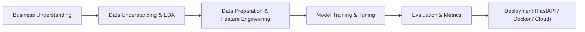

<p align="center">
  
</p>

<h1 align="center">Machine Learning Zoomcamp 2026</h1>

<p align="center">
  <b>Homework Assignments, Practical Notebooks & End-to-End ML Projects</b><br>
  <i>DataTalksClub Machine Learning Zoomcamp (Cohort 2026)</i>
</p>

<p align="center">
  <a href="https://github.com/DataTalksClub/machine-learning-zoomcamp"></a>
  <a href="https://courses.datatalks.club/ml-zoomcamp-2026/"></a>
  <a href="https://datatalks.club/slack.html"></a>
</p>

---

## 🎯 Problem Statement

Machine Learning Engineering requires bridging the gap between theoretical data science and production systems. This repository houses complete hands-on solutions, exploratory data analysis, feature engineering, model training, evaluation, containerization, and production deployment scripts for the **[Machine Learning Zoomcamp 2026](https://github.com/DataTalksClub/machine-learning-zoomcamp)** cohort organized by [DataTalksClub](https://datatalks.club/).

---

## 🏗 Architecture & Workflow

The coursework follows the industry-standard **CRISP-DM** (Cross-Industry Standard Process for Data Mining) iterative lifecycle:



---

## 🗂 Project Structure

```text
ml-zoomcamp2026/
├── 📁 1-intro/                # Module 1: Intro to ML, NumPy, Pandas, Linear Algebra & Homework 1
│   ├── ML Zoomcamp Homework 1.ipynb
│   ├── homework-1-intro.md
│   └── README.md
├── 📄 .gitignore              # Git ignore rules (excluding scratch & 2-regression draft)
└── 📄 README.md               # Main course & repository documentation
```

---

## 🚀 Quickstart & Reproduction

Follow these steps to set up the local environment and reproduce the analysis:

### 1. Clone the Repository
```bash
git clone https://github.com/SPBONIFACE/ml-zoomcamp2026.git
cd ml-zoomcamp2026
```

### 2. Set Up Python Environment (Conda / Virtual environment)
```bash
# Create and activate Conda environment with Python 3.11
conda create -n ml-zoomcamp python=3.11 -y
conda activate ml-zoomcamp

# Install core dependencies
pip install numpy pandas scikit-learn matplotlib seaborn jupyter ipykernel
```

### 3. Launch Jupyter Notebook
```bash
# Register kernel for Jupyter
python -m ipykernel install --user --name ml-zoomcamp --display-name "Python (ml-zoomcamp)"

# Start Jupyter Notebook
jupyter notebook
```

---

## 📊 Data & Configuration

* **Databases / Datasets**: Datasets are fetched dynamically or stored inside respective module directories (e.g., `car_fuel_efficiency.csv` for Module 1).
* **Python Version**: `Python 3.11+`
* **Core Libraries**: `pandas>=2.0`, `numpy>=1.24`, `scikit-learn>=1.3`, `matplotlib`, `seaborn`

---

## 🗺 Roadmap & Syllabus

| Module | Topic | Technologies & Concepts | Status |
| :--- | :--- | :--- | :---: |
| **01** | [Introduction to Machine Learning](./1-intro/) | CRISP-DM, NumPy, Pandas, Linear Algebra | ✅ Completed |
| **02** | Machine Learning for Regression | Linear Regression, Normal Equation, Regularization | 🔄 In Progress |
| **03** | Machine Learning for Classification | Logistic Regression, Categorical Encoding, Metrics | ⏳ Upcoming |
| **04** | Evaluation Metrics & Hyperparameter Tuning | Precision/Recall, ROC-AUC, K-Fold Cross Validation | ⏳ Upcoming |
| **05** | Deploying Machine Learning Models | Web Services, Flask/FastAPI, Docker, Pipenv | ⏳ Upcoming |
| **06** | Decision Trees & Ensemble Learning | Decision Trees, Random Forest, XGBoost | ⏳ Upcoming |
| **07** | Midterm Project | End-to-End ML Project & Deployment | ⏳ Upcoming |
| **08** | Deep Learning & Computer Vision | TensorFlow / Keras, CNNs, Transfer Learning | ⏳ Upcoming |
| **09** | Serverless Machine Learning | AWS Lambda, TensorFlow Lite, Docker | ⏳ Upcoming |
| **10** | Kubernetes & TensorFlow Serving | KServe, EKS / Local Kubernetes | ⏳ Upcoming |
| **11** | Capstone Project | Final Portfolio Project | ⏳ Upcoming |

---

## ⚖️ Decisions & Trade-offs

* **Reproducibility**: Environment commands use pinned Python versioning (`3.11`) to prevent API deprecation issues with `pandas` or `scikit-learn`.
* **Explicit Math Vectorization**: Linear regression in Module 1 is implemented both manually via NumPy matrix inversion ($w = (X^T X)^{-1} X^T y$) and via `scikit-learn` to solidify baseline concepts.

---

## 🔗 Resources & References

* **Official Course Repository**: [DataTalksClub/machine-learning-zoomcamp](https://github.com/DataTalksClub/machine-learning-zoomcamp)
* **Course Platform**: [DataTalksClub Courses](https://courses.datatalks.club/ml-zoomcamp-2026/)
* **YouTube Playlist**: [ML Zoomcamp Video Lectures](https://www.youtube.com/playlist?list=PL3MmuxUbc_hIhxl5Ji8t4O6lPAOpHaCLR)
* **Community**: [DataTalks.Club Slack](https://datatalks.club/slack.html)

---

## 👤 Author

* **GitHub**: [@SPBONIFACE](https://github.com/SPBONIFACE)
* **Cohort**: Machine Learning Zoomcamp 2026
